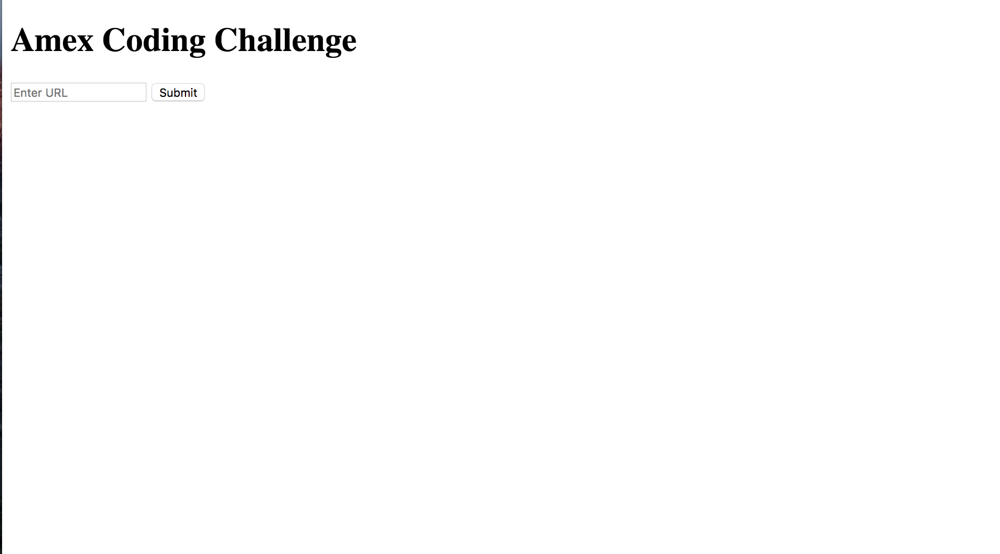

# How to Run

- Clone repository https://github.com/jestir1234/amx_challenge.git

```
$ git clone https://github.com/jestir1234/amx_challenge.git
```

- CD into folder amx_challenge and run rails s (requires ruby version 2.4.0 to be installed).

```
$ rails s
```

- Within browser type in URL localhost:3000. You should see the page.


- Enter URL into the input box. Make sure it is formatted like so https://www.google.com. Click submit and raw html will render.


- Click on elements to highlight all elements with related tags. Click again to unhighlight.

